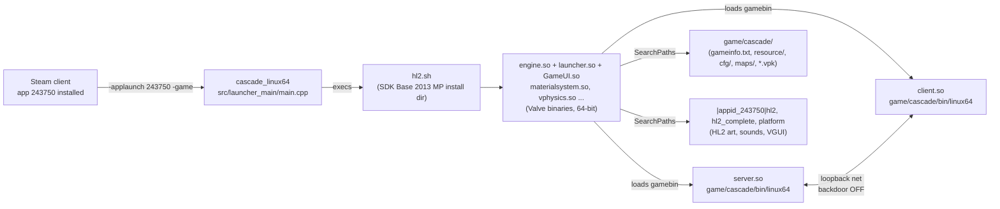
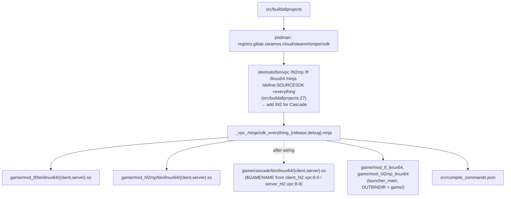

# Cascade — Architecture

Phase 0 audit of the `source-sdk-2013` tree (Valve 2025 64-bit release, `master` @ `b8cfb12c`) for a
singleplayer game built on the **HL2 branch**, run on **Source SDK Base 2013 Multiplayer (app 243750)**.

All `file:line` references are against this commit.

---

## 1. Decision record

| Decision | Choice | Evidence |
|---|---|---|
| Game code branch | HL2 singleplayer (`server_hl2.vpc`, `client_hl2.vpc`, optional episodic) | Full NPC AI, save/restore code, scripted-scene entities. `src/game/server/server_hl2.vpc:18` defines `HL2_DLL;USES_SAVERESTORE` |
| Runtime engine | SDK Base 2013 **Multiplayer**, app 243750, 64-bit | SDK Base 2013 Singleplayer (243730) has no `linux64` binaries and last shipped 2014-era engine (`~/.local/share/Steam/steamapps/common/Source SDK Base 2013 Singleplayer/` has `bin/`, `hl2_linux` only). Upstream `singleplayer` git branch head `77567eb4` predates 64-bit |
| Build path | `src/buildallprojects` (podman, steamrt sniper) with a new `/hl2` VPC flag | HL2 project files exist but are **not wired**: `src/vpc_scripts/projects.vgc:16-20,51-55,57-61` only reference `[$TF]` and `[$HL2MP]` |
| Content mounts | `\|appid_243750\|hl2/*.vpk` + `hl2_complete/*.vpk` (HL2 textures/models/sounds; **no campaign maps** — only `background01.bsp`, `test_hardware.bsp`). TF2 (440) **not** mounted | `game/mod_hl2mp/gameinfo.txt:59-79` shows the exact paths; SDK Base MP ships `hl2/` and `hl2_complete/` |
| Save/restore | Ship as **checkpoint-based** first; full quicksave is a Phase 3 spike | Upstream issue #629: datadescs not 64-bit-clean, vphysics restore crashes in `vphysics.so` (engine, not ours) |
| Local network backdoor | Force `cl_localnetworkbackdoor 0` in `cfg/` until SDK Base engine is patched | Upstream issue #610: SP listen server crashes in `SendProxy_AnimTime` with backdoor on. Fixed in TF2 engine 2026-03, not in SDK Base |

Rejected: TF2 branch (no save/restore, ~900 files of live-service code to disable), HL2MP branch (no NPC AI),
old `singleplayer` git branch (32-bit, no Linux 64 flow, no podman build).

---

## 2. Runtime — C4 container view

Launcher facts (`src/launcher_main/main.cpp`):

| What | Line | Behaviour |
|---|---|---|
| Mod name from exe | `571` `GetExecutableModName` | strips path, then everything from the last `_` (`cascade_linux64` → `cascade`) |
| Engine dir | `191` `GetGameInstallDir`, used at `625` | resolves SDK Base install dir via Steam, execs `<dir>/hl2.sh` (`631`) |
| Default `-game` | `649-659` | appends `-game <repo>/game/<modname>` unless caller passed `-game` |
| App id | `launcher_main_mod_tf.vpc:11` `MOD_APPID=243750` | per-launcher vpc; Cascade gets its own `launcher_main_cascade.vpc` |

Game DLL facts:

| What | File:line |
|---|---|
| Gamerules instantiated | `src/game/server/hl2/hl2_client.cpp:162-175` `InstallGameRules()` → `CreateGameRulesObject("CHalfLife2")` |
| `CHalfLife2 : CSingleplayRules` | `src/game/shared/hl2/hl2_gamerules.h:31`, registered `hl2_gamerules.cpp:31` |
| `IsMultiplayer() == false` | `src/game/shared/singleplay_gamerules.cpp:29` |
| Player limits `minplayers = 1` | `src/game/server/base_gameinterface.cpp:14-18` (HL2 uses this file; TF/HL2MP force 2) |
| Save/restore gate | `USES_SAVERESTORE` checked at `src/game/server/baseentity.cpp:3842`; game side `src/game/server/saverestore_gamedll.cpp` |
| Client mode | `src/game/client/hl2/clientmode_hlnormal.cpp` |
| Main menu | engine `GameUI.so` + `resource/GameMenu.res` in the mod dir. No `GameMenu.res` ships in `game/mod_hl2mp/` today — Phase 2 creates it |

---

## 3. Build — container view

| Item | Value |
|---|---|
| VPC project list | `src/vpc_scripts/projects.vgc` — client `16-20`, server `51-55`, launcher `57-61` |
| Groups | `src/vpc_scripts/groups.vgc:35` `everything`, `17` `game`, `11` `gamedlls` |
| `$Games` | `src/vpc_scripts/default.vgc:11-24` already lists `HL2`, `EPISODIC` → `/hl2` flag is legal, just unreferenced |
| Output dir macro | `src/game/{client,server}/{client,server}_base.vpc:8` `OUTBINDIR = game/$GAMENAME/bin`; `GAMENAME` set per game vpc (`mod_hl2` under `$SOURCESDK`) |
| Save/restore define | only `server_hl2.vpc:18` and `server_episodic.vpc:18` |
| nav_mesh | `server_hl2mp.vpc`, `server_tf.vpc` only. HL2 does not need it (uses `.ain` node graphs) |
| Replay | `client_base.vpc:18`, `server_base.vpc:18` gated `[$TF]` — not linked for HL2 |
| Econ / GC | include dirs only (`server_base.vpc:64`); no `$Lib gcsdk`, no econ sources in `client_hl2.vpc` / `server_hl2.vpc` |
| Windows-only tools | vbsp/vvis/vrad/studiomdl/vtex — `sdktools/` in SDK Base has no linux64 build. `bin/linux64/vpk` **does** exist in SDK Base MP |
| Release build | 2026-09-09, ~6 min on 16 cores with ccache. `client.so` 426 MB unstripped (TF) |

---

## 4. Repo map

| Path | Files | Role for Cascade |
|---|---|---|
| `src/game/server/hl2/` | 55 `npc_*.cpp`, weapons, vehicles, triggers | **Core.** Enemy/ally AI, HL2 weapons |
| `src/game/server/ai_*.cpp` | 61 | Core AI framework (schedules, memory, squads, goals) |
| `src/game/server/episodic/` | 26 | Optional: hunter, advisor, magnusson, striderbuster, Alyx-injured behaviour |
| `src/game/client/hl2/` | 79 | HUD (14 `hud_*.cpp`), client NPC/weapon effects, `clientmode_hlnormal` |
| `src/game/shared/hl2/` | 17 | `hl2_gamerules`, `survival_gamerules`, movement, usermessages |
| `src/game/shared/episodic/` | 4 | EP1/EP2 achievements |
| `src/game/client/game_controls/` | 37 | Shared VGUI panels (team menu, spectator etc.) |
| `src/game/{client,server,shared}/tf/` | ~900 | **Not compiled** for Cascade |
| `src/game/shared/econ/`, `src/gcsdk/` | 55+, 16 | Not compiled |
| `src/game/client/replay/` | 55 | Not compiled (`[$TF]`) |
| `src/launcher_main/` | — | Launcher; one vpc per mod |
| `game/mod_hl2mp/` | — | Template for `game/cascade/` (gameinfo, cfg, resource) |
| `game/mod_tf/` | — | Reference only. `gameinfo.txt` says `"Frog Fortress 2"` — Valve's own placeholder (commit `0759e2e8`) |

---

## 5. Subsystem verdict table

Legend — **keep**: compiled and used · **stub**: compiled, disabled by `hx_` ConVar / `CHxGameRules` · **out**: not in the Cascade link at all (C5 satisfied by never compiling it, upstream files untouched) · **later**: revisit after v0.1.

### TF2 live-service systems (all `out` — never in `client_hl2.vpc` / `server_hl2.vpc`)

| Subsystem | Location | Verdict |
|---|---|---|
| MvM / populators | `src/game/server/tf/player_vs_environment/` (48) | out |
| Econ / items / loadouts | `src/game/shared/econ/` (55), `client/econ/` (62) | out |
| Matchmaking / party / lobby | `src/game/server/tf/*matchmaking*` (37) | out |
| GC / gcsdk / protobuf messages | `src/gcsdk/` (16) | out (protobuf lib still links via `protobuf_include.vpc`, harmless) |
| Replay | `src/game/client/replay/` (55), `source_replay.vpc [$TF]` | out |
| Halloween | `src/game/server/tf/halloween/` (84) | out |
| Competitive / ladder | `src/game/server/tf/tf_competitive*` | out |
| Quests / contracts | `*quest*` (36) | out |
| Training | `tf_hud_training*` (10) | out |
| Workshop | `src/game/shared/workshop/` (2) | out |
| TF NextBot / nav_mesh | `server/tf/bot/` (166), `server/NextBot/`, `nav_mesh.vpc` | out. HL2 AI uses `.ain` node graphs (`nodegraph 1` in gameinfo) |
| Steamworks client calls | 328 `steamapicontext` refs in `client/tf` vs ~0 in `client/hl2` | out |

### HL2 branch systems

| Subsystem | Location | Verdict | Note |
|---|---|---|---|
| `CHalfLife2` gamerules | `shared/hl2/hl2_gamerules.*` | keep, subclass as `CHxGameRules` | Single override point (Phase 3) |
| `CHalfLife2Survival` | `shared/hl2/survival_gamerules.cpp` | out | Episodic-only, `gamerules_survival` cvar |
| Save/restore | `server/saverestore_gamedll.cpp`, `USES_SAVERESTORE` | keep compiled, **stub** autosave/quicksave until 64-bit datadesc spike passes | Issue #629 |
| HL2 NPC roster (55) | `server/hl2/npc_*.cpp` | keep | Prune by not spawning, not by deleting |
| Episodic extras | `server/episodic/` | later | Adds `HL2_EPISODIC`; decide with level design |
| HL2 weapons (16) | `server/hl2/weapon_*.cpp`, `client/hl2/c_weapon_*` | keep | Roster enforced in `CHxGameRules` |
| Vehicles (jeep, airboat, APC, crane) | `server/hl2/vehicle_*.cpp` | stub | vphysics restore crash (#629) — avoid in v0.1 |
| HUD (14 elements) | `client/hl2/hud_*.cpp` | keep, reskin | Phase 2 schemes |
| Achievements | `shared/hl2/achievements_hl2.cpp`, `shared/episodic/achievements_ep*.cpp` | stub | Steam-app-dependent; later |
| Gamestats upload | `server/hl2/hl2_gamestats.cpp` | stub | Phones home to Valve HL2 stats; disable |
| Choreo / scripted scenes | `server/sceneentity.cpp`, `choreoobjects` lib | keep | Core SP tooling |
| Node graph AI nav | `server/ai_network*.cpp`, `ai_node*.cpp` | keep | Maps need `.ain` (built on first load) |
| Engine GameUI main menu | `GameUI.so` + `resource/GameMenu.res` | keep, restyle | Phase 2 |
| Local network backdoor | engine ConVar `cl_localnetworkbackdoor` | **force 0** in `cfg/valve.rc`/`config_default.cfg` | Issue #610 |

---

## 6. Known engine-level risks (cannot be fixed in this repo)

| Risk | Source | Mitigation |
|---|---|---|
| SP listen server crash with network backdoor | SDK Base MP engine; upstream #610 | `cl_localnetworkbackdoor 0` (verified workaround in #610 thread) |
| Save/restore: vphysics objects/constraints break on load, vehicle restore crashes in `vphysics.so` | upstream #629 | Checkpoint design; no physics vehicles in v0.1; audit datadescs for 64-bit sizes (`src/public/datamap.h:100-118`) |
| Engine binaries only update when Valve pushes SDK Base MP | upstream #1848 | Track; option to test against TF2 (440) engine per #610 comment, not shippable |
| Windows-only content tools | `sdktools/` | Phase 4 documents Proton/Windows steps (C3) |
