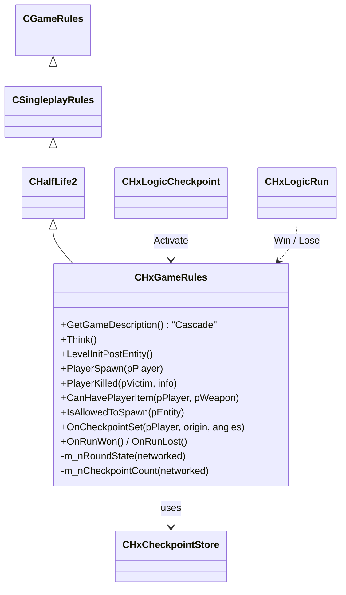
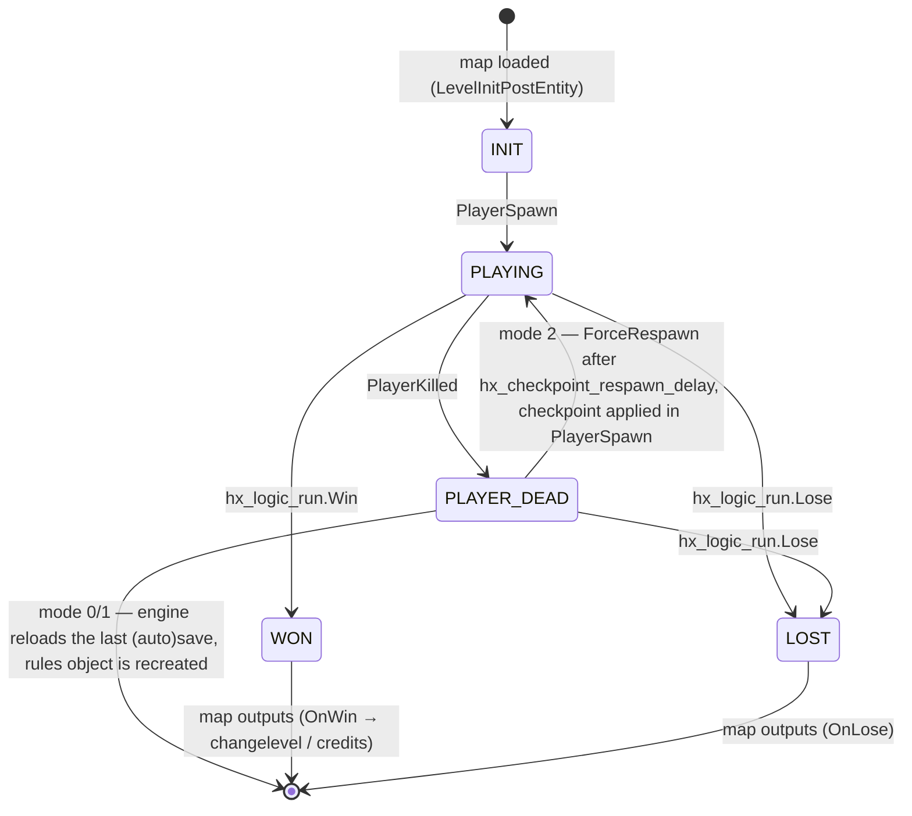

# Cascade — gameplay foundation

Phase 3 delivers the skeleton every later mechanic hangs off: one rules class, one round loop, one
checkpoint system, two logic entities, one HUD element, and the `hx_` ConVar block. Nothing here
deletes HL2 behaviour; everything is an override or an opt-in (constraint C5).

## Override point

| Piece | File | Notes |
|---|---|---|
| `CHxGameRules` | `src/game/shared/hx/hx_gamerules.{h,cpp}` | Registered with `REGISTER_GAMERULES_CLASS`; created by `InstallGameRules()` in `src/game/server/hl2/hl2_client.cpp` under `HX_DLL`. Proxy entity `hx_gamerules`, data table `DT_HxGameRules` |
| ConVars | `src/game/shared/hx/hx_convars.cpp` | All `hx_*`, replicated |
| Checkpoint store | `src/game/server/hx/hx_checkpoint.{h,cpp}` | `g_HxCheckpointStore`, survives the per-map rules recreation |
| Entities | same file | `hx_logic_checkpoint`, `hx_logic_run`; FGD in `game/cascade/cascade.fgd` |
| User message | `src/game/shared/hx/hx_usermessages.cpp` | `HxCheckpoint` (1 byte), registered from `hl2_usermessages.cpp` under `HX_DLL` |
| HUD | `src/game/client/hx/hx_hud_checkpoint.cpp` | `HudHxCheckpoint` in `game/cascade/scripts/HudLayout.res`; strings `hx_*` in `resource/cascade_english.txt` |
| Build | `src/game/server/server_hx.vpc`, `src/game/client/client_hx.vpc` | Included from the HL2 vpcs; define `HX_DLL`, add `game/shared/hx` to the include path |

## Round loop

`m_nRoundState` is networked so the HUD can show RUN COMPLETE / RUN FAILED without a message.

## Checkpoints

| `hx_checkpoint_mode` | On `hx_logic_checkpoint.Activate` | On death | Trade-off |
|---|---|---|---|
| `0` | nothing | stock HL2 (engine reloads last save, if any) | Off switch |
| `1` (default) | snapshot + `autosave` (same path as `logic_autosave`) | engine reloads the autosave | Full world state restored. Relies on 64-bit save/restore: works on the spike map after the Phase 1/3 datadesc fixes; vphysics constraints and vehicles still risky (upstream #629) |
| `2` | snapshot only | after `hx_checkpoint_respawn_delay` the player is respawned in place and rebuilt from the snapshot | No load screen, deterministic player state, but the world keeps its post-death state (killed NPCs stay dead, doors stay open). Good for arcade/run design |

Snapshot contents (`CHxCheckpointStore::Capture`): map name, origin, angles, health, armor, suit, every weapon with clip1/clip2, every ammo type with a count, active weapon. `ApplyTo` strips the inventory (`RemoveAllItems`, `RemoveAllAmmo`) and rebuilds it (`GiveNamedItem`, `SetClip1/2`, `SetAmmoCount`, `Weapon_Switch`, `Teleport`, `SnapEyeAngles`).

The store is cleared when a different map loads (`IsValidForMap`).

## Rosters

| ConVar | Enforced where | Gap |
|---|---|---|
| `hx_weapon_roster` | `CanHavePlayerItem` (pickup), `IsAllowedToSpawn` (item_world / NPC drops) | Weapons given by script (`GiveNamedItem`) bypass it on purpose |
| `hx_npc_roster` | `LevelInitPostEntity` removes map-placed NPCs not on the list | NPCs from `npc_maker` / templates are not filtered yet |

Empty string = allow all. Values are comma-separated classnames, case-insensitive.

## Developer commands

| Command | Flags | Effect |
|---|---|---|
| `hx_checkpoint` | cheat | Checkpoint at the player's position |
| `hx_run_win`, `hx_run_lose` | cheat | Force terminal states |
| `hx_round_state` | — | Print state, checkpoint count, store validity |
| `hx_version` | replicated | Version string, `HX_GAME_VERSION` in `hx_shareddefs.h` |

## 64-bit save/restore audit (Phase 3.4)

Spike: `+map test_hardware +save hxspike +load hxspike` with the release DLLs restores and keeps running.
Restore printed two "wrong FIELD_ type" warnings, both fixed:

| Field | Was | Now | Why |
|---|---|---|---|
| `PhysBlockHeader_t::pWorldObject` (`src/game/shared/physics_saverestore.cpp:46`) | `FIELD_INTEGER` (4 of 8 pointer bytes) | `DEFINE_ARRAY(..., FIELD_CHARACTER, sizeof(IPhysicsObject *))` | The saved value is the remap key for the world physics object on restore; truncated keys never matched — a plausible cause of the broken constraints in upstream #629 |
| `CAI_BaseNPC::taskFailureCode` (`src/game/server/ai_basenpc.cpp:10788`) | `FIELD_INTEGER` | `DEFINE_ARRAY(..., FIELD_CHARACTER, sizeof(AI_TaskFailureCode_t))` | `AI_TaskFailureCode_t` is `intp` (`ai_task.h:24`) |

No `FIELD_INTEGER64` exists in `public/datamap.h`, and adding one would change an enum the engine also compiles, so raw byte arrays are the least invasive fix.

Still open: vehicles (`CPhysSaveRestoreBlockHandler::RestorePhysicsObject` crash in `vphysics.so`, engine-side) — keep vehicles out of v0.1 maps.
